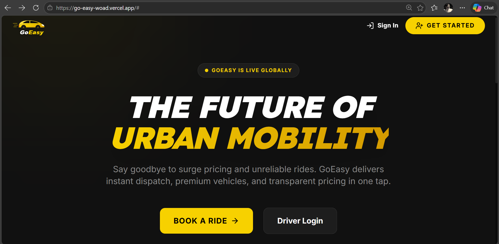

# 🚗 Go-Easy | Next-Gen Urban Mobility

Go-Easy is a premium, full-stack ride-hailing platform designed for seamless urban transportation. Built with a focus on speed, safety, and transparent pricing, it bridges the gap between passengers and drivers through a sleek, high-performance interface.





## ✨ Key Features

### 👤 For Customers
- **Instant Booking**: Smart location detection and one-tap ride requests.
- **Fair Pricing**: Real-time fare estimation with a tiered discount model for long-distance luxury.
- **Ride Tracking**: Live status updates from booking to arrival.
- **Secure Handshake**: OTP-based ride starts to ensure you're in the right vehicle.

### 🚖 For Drivers
- **Intuitive Dashboard**: Toggle availability and track active requests in real-time.
- **Earnings Analytics**: Comprehensive trip history and total earnings tracking.
- **Flexible Payments**: Support for both Cash and UPI payments with on-screen QR generation.
- **Intelligent Routing**: Optimized distance calculations for better efficiency.

## 🛠️ Tech Stack

- **Frontend**: React (Vite), TailwindCSS, Lucide Icons, Framer Motion.
- **Backend**: Java Spring Boot, Spring Security (JWT), Hibernate JPA.
- **Database**: PostgreSQL (hosted on Neon.tech).
- **Deployment**: Render (Backend/Docker) & Vercel (Frontend).

## 🚀 Getting Started

### 1. Prerequisites
- Node.js (v18+)
- Java JDK 17
- Maven

### 2. Setup Database
Update `backend/src/main/resources/application.properties` with your PostgreSQL credentials.

### 3. Run Backend
```bash
cd backend
./mvnw spring-boot:run
```

### 4. Run Frontend
```bash
cd frontend
npm install
npm run dev
```

## 🌍 Deployment

### Backend (Render)
The project includes a multi-stage `Dockerfile` ready for Render deployment. Ensure you set the `PORT` environment variable.

### Frontend (Vercel)
Optimized for Vercel with a `vercel.json` configuration to handle Single Page Application (SPA) routing.

---
**Made with ❤️ in India by Pravesh Kumar**
